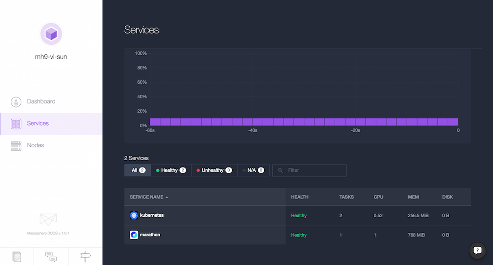

# Mesos Codefest
Fast alle modernen Softwaresysteme laufen auf einem Cluster. Wird das Cluster mit klassischen Mitteln betrieben, so sieht man immer wieder dieselben Probleme:
* Zu hohe Betriebskosten, da die Server kaum ausgelastet sind. Mit der geringen Auslastung erkauft man sich Kapazitäten für Spitzenlasten und Isolation von einzelnen Anwendungsteilen – klassische Opportunitätskosten.
* Zu hohe Betriebskosten durch den Overhead von Hardware-Virtualisierung.
* Standard-Betriebsprozeduren wie Installationen, Rolling Updates, Canary Releases und Rollbacks sind aufwändig,
fehleranfällig und nur schwer zu automatisieren.
* Zentrale Betriebsfunktionen wie Monitoring, Failover, Absicherung oder Skalierung müssen pro
Anwendung neu aufgesetzt und konfiguriert werden. Dies ist aufwändig und fehleranfällig.

Ein Cluster-Betriebssystem wie Apache Mesos / Mesosphere DCOS löst diese Probleme auf elegante Weise. Es überträgt das Prinzip eines klassischen Betriebssystems, das über einen einzigen Rechner herrscht, auf ein Rechen-Cluster aus vielen Rechnern. Es abstrahiert dabei viele Rechner zu einem großen Rechner. Damit werden Betriebsprozeduren so einfach wie auf nur einem Rechner. Die Betriebskosten sinken deutlich, da durch intelligentes Scheduling und durch den Einsatz von Betriebssystem-Virtualisierung die Auslastung deutlich steigt und der Overhead deutlich sinkt.
Cluster-Betriebssysteme werden bereits massiv im Sillicon Valley eingesetzt (z.B. bei Apple Siri, Twitter und Airbnb) aber auch bei eher klassischen IT-Nutzern wie CenturyLink, Verizon, Walmart und dem CERN. Es existiert eine Vielzahl an Erfahrungsberichten mit der neuartigen Betriebsumgebung, die i.W. von hohen Kosteneinsparungen und gesteigerter Flexibilität im Betrieb berichten.
Im folgenden Tutorial wollen wir die folgenden Fragestellungen vertiefen:
* Wie funktioniert ein Cluster-Betriebssystem am Beispiel Apache Mesos / Mesosphere DCOS?
* Was ist der Nutzen eines Cluster-Betriebssystems?
* Wie können Anwendungen so (um-)gebaut werden, dass sie auf einem Cluster-Betriebssystem
laufen?

Grundvoraussetzung ist ein Rechner mit Vagrant (https://www.vagrantup.com), VirtualBox (https://www.virtualbox.org) und MinGW (http://www.mingw.org/). Vor dem Tutorial bitte bereits eine Ubuntu Box für Vagrant herunterladen mit dem Befehl `vagrant box add ubuntu/trusty64`.


# Container Management mit Docker und Mesos/Marathon

## Inhalte

Eine Vagrant-Umgebung initialisieren `vagrant init ubuntu/trusty64`, die Box starten `vagrant up` und per SSH in die Box verbinden `vagrant ssh`.

Zuerst die DCOS CLI installieren: https://docs.mesosphere.com/install/cli.
Anschließend dieses Repo in den Ordner clonen, in dem die CLI installiert wurde. Zum Beispiel habe ich die CLI unter `~/dcos/` installiert, deshalb führe ich folgendes durch:

```
$ pwd
/home/vagrant/dcos
$ git clone https://github.com/qaware/mesos-codefest.git
Cloning into 'mesos-codefest'...
remote: Counting objects: 10, done.
remote: Compressing objects: 100% (10/10), done.
remote: Total 10 (delta 3), reused 0 (delta 0), pack-reused 0
Unpacking objects: 100% (10/10), done.
Checking connectivity... done.
$ ls -la
total 32
drwxrwxr-x 6 vagrant vagrant 4096 Dec  6 19:06 .
drwxr-xr-x 6 vagrant vagrant 4096 Dec  6 19:01 ..
drwxrwxr-x 2 vagrant vagrant 4096 Dec  6 19:02 bin
-rw-rw-r-- 1 vagrant vagrant 3654 Dec  6 19:02 install.sh
drwxrwxr-x 3 vagrant vagrant 4096 Dec  6 19:02 lib
drwxrwxr-x 2 vagrant vagrant 4096 Dec  6 19:02 local
drwxrwxr-x 3 vagrant vagrant 4096 Dec  6 19:06 mesos-codefest
-rw-rw-r-- 1 vagrant vagrant   60 Dec  6 19:02 pip-selfcheck.json
```

Im weiteren Verlauf werden wir den Ordner, in dem wir die CLI installiert haben, einfach `$DCOS_CLI_HOME` nennen.

Jetzt noch das DCOS Cluster Dashboard im Browser öffnen und wir sind startbereit.



Die Sessions sind:

1. [Containers &amp; Docker](./docker)
1. [Mesos &amp; Marathon](./mesos-marathon)

## Weiterführende Informationen

- [DCOS doc](https://docs.mesosphere.com)
- [Docker doc](https://docs.docker.com/)
- [Mesos doc](http://mesos.apache.org/documentation/latest/) | [Marathon doc](https://mesosphere.github.io/marathon/docs/)
